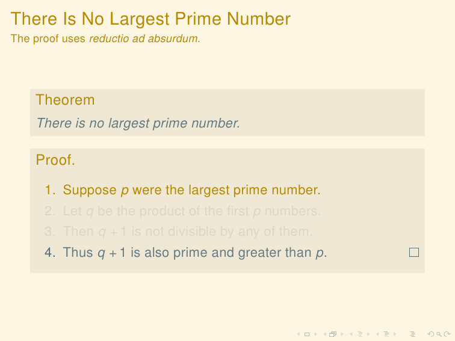

Beamer Color Theme Solarized
===============================

A color theme for `Beamer
<http://www.ctan.org/tex-archive/macros/latex/contrib/beamer/>`_ using
the `Solarized <http://ethanschoonover.com/solarized>`_ palette, and
inspired by the css stylesheet of `ethanshoover.com
<https://github.com/altercation/ethanschoonover.com/blob/master/resources/css/style.css>`_.

See the `Solarized homepage <http://ethanschoonover.com/solarized>`_
and its `github page
<https://github.com/altercation/ethanschoonover.com>`_ more
information about the color palette and themes for Vim, Emacs, etc.

If you use **R**, I have also written a
[ggplot](http://had.co.nz/ggplot2/) theme and scales using the
Solarized colors available at https://github.com/jrnold/ggplotJrnold.

Installation
===============

Download the theme from https://github.com/jrnold/beamercolorthemesolarized and
place it in either the same folder as your presentation .tex file or
in the LaTeX installation tree.

Usage
================

To load the color theme, add the following line to your document,

::

  \usecolortheme[<options>]{solarized}

The following *<options>* may be given when loading the theme,

- ``light`` Use the light theme (default).
- ``dark`` Use the dark theme.
- ``accent=`` *<color>* The accent color. *<color>* can be any of the
  non-base Solarized colors: ``yellow`` (default), ``orange``,
  ``red``, ``magenta``, ``violet``, ``blue``, ``cyan``, or
  ``green``.

For example, to use a dark theme with a cyan accent, 

::

  \usecolortheme[dark,accent=cyan]{solarized}

In addition to the beamer colors that it sets, this package defines
colors which can be used elsewhere, e.g. in ``\setbeamercolor``.
 
The package defines the sixteen colors of the Solarized palette.

:: 

    solarizedBase03    #002b36 
    solarizedBase02    #073642 
    solarizedBase01    #586e75 
    solarizedBase00    #657b83 
    solarizedBase0     #839496 
    solarizedBase1     #93a1a1 
    solarizedBase2     #eee8d5 
    solarizedBase3     #fdf6e3 
    solarizedYellow    #b58900 
    solarizedOrange    #cb4b16 
    solarizedRed       #dc322f 
    solarizedMagenta   #d33682 
    solarizedViolet    #6c71c4 
    solarizedBlue      #268bd2 
    solarizedCyan      #2aa198 
    solarizedGreen     #859900 

Additionally, it defines these colors, the values of which are
dependent on the options specified when the theme is loaded.

- ``solarizedAccent`` Accent color.
- ``solarizedRebase03``, ``solarizedRebase02``, ``solarizedRebase01``, ``solarizedRebase00``: Background colors; dark colors if the dark theme is used, light colors if light theme.
- ``solarizedRebase0``, ``solarizedRebase1``, ``solarizedRebase2``, ``solarizedRebase3``: Foreground colors; light colors if the dark theme is used, dark colors if light theme.

Examples
=================

Some example slides (using the example slides from the Beamer
documentation).

A light background with yellow  accents (the default).

.. code:: latex

  \usecolortheme{solarized} 

.. image:: https://raw.github.com/jrnold/beamercolorthemesolarized/master/examples/example_yellow_light-1.png
   :scale: 50%

A light background with blue accents.

.. code:: latex

  \usecolortheme[accent=blue]{solarized} 

A dark background with yellow accents.

.. code:: latex

  \usecolortheme[dark]{solarized} 

..  LocalWords:  solarized
